# Security in DevOps

Mircea Lungu
mlun@itu.dk
[IT University of Copenhagen, Denmark](https://www.itu.dk)<br>
[](https://www.inc.com/joe-galvin/60-percent-of-small-businesses-fold-within-6-months-of-a-cyber-attack-heres-how-to-protect-yourself.html)


# Motivation

## Why does FB need thousands of developers when I could implement a clone with a friend in our spare time? 


- Creating a proof-of-concept of Facebook is not that hard. 
- **With a friend I once implemented  a Facebook clone in our spare time** in parallel with doing our PhDs. 
- Maintaining Facebook itself takes thousands of talented developers working non stop on it. 
- What is the difference? Where are all those man-hours going?


### Building Dependable Systems Is what is difficult

My claim is that the reason is that they have built a **dependable** system. 

Dictionary defines dependable as *trusthworthy* and *reliable*. This is the difference between my friend and my FB and the real deal. You can trust that millions of people have access to the real FB at any time and it's services will always be there. 


Sommerville decomposes **dependability** into multiple components: 

- **Availability**  -- probability that a system is operational at a given time -- Uptime / (Uptime + Downtime), e.g. "5 nines"

- **Reliability** -- probability of correct functioning  for some given time  -- MTBF = mean time between failures 

- **Safety**  -- ability to operate w/o catastrophic failure

- **Security** <-- fighting against the fact that "information wants to be free" :) I'll explain a bit later what this means.

I remember one of my googler friends once telling me proudly that he has been upgraded from engineer to site reliability engineer, and this was one of the most important roles in the company. 


### Site Reliability Engineer = developer + ops + automation + security experiments

The importance of reliability was recognized early by Google when they introduced 
- the role of site reliability engineer and 
- a [site-readability team in 2003](https://www.usenix.org/conference/srecon14/technical-sessions/presentation/keys-sre). 

> "The SRE role of today **combines** the skills of the **developer** responsible for writing applications and the skills that **operations engineers** use to deploy those applications. 

*To think about*: *does this sound like something else that you know about?* 


What does an SRE do?

> The SRE moves an application from proof of concept, to quality control, and then to deployment – **automating that entire process** and giving it consistency.

*To think about: Does it sound like something else you know about?*


What else does an SRE do? 

> By **continuing to run security experiments**, we can evaluate and improve such vulnerabilities proactively in the ecosystem before they become crisis situations." 

Quotes from: [Through the looking glass: Security and the SRE](https://opensource.com/article/18/3/through-looking-glass-security-sre)

No stress about the terminology... what matters is the details. Automation, security, these are essential problems 


### "Information wants to be free"


> *Information wants to be free*
> 
> *Information also wants to be expensive.*
> 
> *That tension will not go away*

(From: The Media Lab: Inventing the future ..., by Stewart Brand)


- The information in your systems wants to be free and 
- many people are after it. 
- Your goal is to protect it. This is **security**:

> ... the protection of computer systems and networks from the theft of or damage to their hardware, software, or  data, as well as from the disruption or misdirection of the services they provide. [1]

[1] https://commons.erau.edu/cgi/viewcontent.cgi?article=1476&context=jdfsl 


## Most breaches are found only after the damage is done

So how likely is the kind of scenario we're about to walk through? Unfortunately quite likely. In an article about the [Cost of Data Breach Study](https://documents.ncsl.org/wwwncsl/Task-Forces/Cybersecurity-Privacy/IBM_Ponemon2017CostofDataBreachStudy.pdf) by IBM we learn that: 

1. **The most common way to discover security failures** is when a security incident happens. 
2. **Average time until people found out they were hacked** is quite long: 
	  - half a year
	  - By this time, it is often too late, and damage has been done. 

*Second hand anecdote*: Russian vs. Brazilian hackers.


# Case study: that time when I migrated my app to a new server and... you will never guess what happened :)

Before the story, I must introduce two concepts that are related to security and devops.

## A reverse proxy centralizes TLS, port exposure, load balancing, and caching

- A Reverse Proxy is a server that 
	- acts on behalf of one or more other servers
	- forwards the client requests to the appropriate servers
	- forwards responses back on behalf of the servers

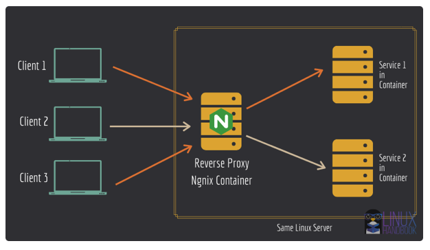


[Forward proxy vs. reverse proxy: an analogy](https://www.pankajtanwar.in/blog/proxy-vs-reverse-proxy-using-a-real-life-example)

Why reverse proxy? 
- security
	- protecting ports done in a centralized manner
	- TLS deployed only once
- load balancing
- caching

## A firewall denies everything by default and opens only the ports you need

A firewall is a system that limits access to servers and processes based on the **source** and **destination** of the accesses, where these are defined in terms of **IP_ADDRESS:PORT** pairs.  

Firewalls can be either hardware or software. 

Most often we'll be working with software firewall installed on our servers. 

E.g. allowing HTTP, SSL, and HTTPS traffic on a server with the help of [`iptables`](https://erravindrapawadia.medium.com/iptables-tutorial-beginners-to-advanced-guide-to-linux-firewall-839e10501759) firewall software: 

```
$  sudo iptables –A INPUT –p tcp  ––dport 80 –j ACCEPT
$  sudo iptables –A INPUT –p tcp ––dport 22 –j ACCEPT
$  sudo iptables –A INPUT –p tcp ––dport 443 –j ACCEPT

```
Or a simper, and more modern firewall software: [`ufw`](https://www.digitalocean.com/community/tutorials/how-to-set-up-a-firewall-with-ufw-on-ubuntu) where u stands for *uncomplicated*.  

```
$ sudo ufw allow ssh

Rule added
Rule added (v6)
```

Why firewall? Every open port is an attack surface. A service you forgot about, a database you assumed was internal-only — if the port is reachable, someone will find it. Default policy: **deny everything, then allow only what you need.**


## TLS encrypts traffic so the network path can't read or modify it

### When a browser talks to a server over plain HTTP, the traffic is **unencrypted**

Anyone on the network path — a coffee shop Wi-Fi, an ISP, a compromised router — can read or modify it. This includes passwords, session tokens, API keys, and user data.

### **TLS** (Transport Layer Security) encrypts the connection between client and server

TLS relies on **certificates** issued by a Certificate Authority (CA). 

The certificate proves to the browser that the server is who it claims to be. 

Without it, you get the browser warning that users have learned to fear.

### HTTPS is simply HTTP over TLS.

### **Let's Encrypt** is a free, automated CA

Combined with **Certbot**, you can get a certificate in one command:

```
$ sudo certbot --nginx -d your_domain.dk
```

Certbot will also set up automatic renewal — certificates expire every 90 days.

In practice, TLS is terminated at the **reverse proxy** (e.g., Nginx), so your application servers don't need to deal with certificates at all. This is one of the key benefits of the reverse proxy pattern.

For a step-by-step setup guide, see the [TLS Tutorial](TLSTutorial.md).


## Back to the story

I moved my stack from one server to another.  

Next day I realize that the ElasticSearch queries don't work. 

I query the main index and don't find it. 

I look for all the indexes, and there is a new index in the db called `__read__me`. 

This is bad. 

I list the documents in it, and find a single document that you can see below: 

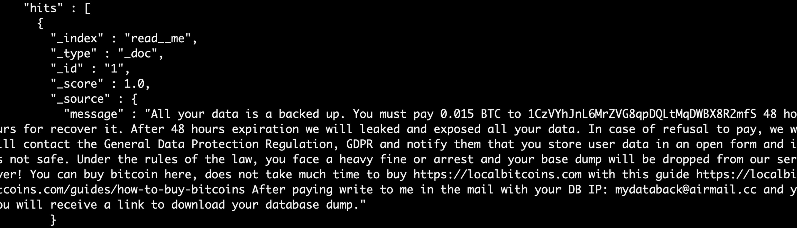

How could this happen? Let's see what I deployed on the new server: 
- Flask API talks to ElasticSearch and MySQL 
- NGINX - as *reverse proxy*  + TLS provide 
- `ufw` rules to block everything but ports 80 and 443
- Relevant docker-compose fragment is highlighted near the *elasticsearch*


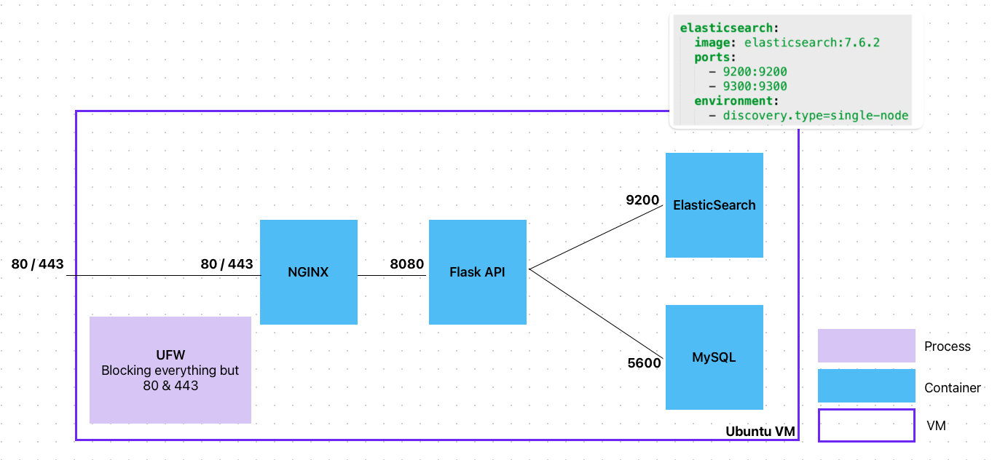


The answer is a combination of factors:
- Docker circumvents the UFW firewall and alters iptables directly when you instruct it about ports
- Mapping the ports with `-p 9200:9200` (or in docker-compose) maps the port to the host but also opens it to the world! ([bug report from '19](https://github.com/docker/for-linux/issues/690))) 
	> Publishing ports produce a firewall rule that binds a container port to a port on the Docker host, ensuring the ports are accessible to any client that can communicate with the host.

- ElasticSearch server was not password protected - because I was sure that it's behind the firewall...


### Lessons learned
- You must know how the tools you work with work! (e.g. [configure Docker to not do this](https://www.techrepublic.com/article/how-to-fix-the-docker-and-ufw-security-flaw/)) ) 
- You must have a backup - luckily the ES database was backed up so I didn't have to pay
- **You must not rely on a single security mechanism** (e.g. firewall) but use multiple (e.g. protect the ES db also with a password)


### Practical
- Can you map the port for Grafana? Yes,.
- See also: [configure Docker to not do this](https://www.techrepublic.com/article/how-to-fix-the-docker-and-ufw-security-flaw/)


# Systematic security has four steps: understand threats, assess risks, test, detect

If one is to follow a  **systematic approach** to security, this would mean a four-pronged approach consisting of: 

  1. Understanding threats

  2. Assessing risks & hardening security
  
  3. Testing security

  4. Detecting breaches

In this section we will briefly discuss each of these in turn.

## You can only influence opportunity — intent and capability belong to the attacker

A threat = **intent + capability + opportunity**. You can only influence *opportunity* — the surface area you expose. Intent and capability belong to the attacker (black hats, script kiddies, and occasionally white/grey hats on your side).

Your job: **reduce the opportunity.** Analyze your system and think like someone trying to break in. 

Framework for Discovering Opportunities for Web Applications: [Open Web Application Security Project](https://owasp.org/www-project-top-ten/) OWASP

- Online Community

- Maintains lists of vulnerabilities for web applications

- **OWASP Top 10** Include:
  1. [Broken Access Control](https://owasp.org/Top10/A01_2021-Broken_Access_Control/) : e.g., broken permissions, broken authorization
  3. [Injection](https://owasp.org/Top10/A03_2021-Injection/): e.g., XSS, SQL, etc.
  6. [Vulnerable and Outdated Components](https://owasp.org/Top10/A06_2021-Vulnerable_and_Outdated_Components/)
  9. [Security Logging and Monitoring Failures](https://owasp.org/Top10/A09_2021-Security_Logging_and_Monitoring_Failures/): e.g., auditable events are not logged, logs are not monitored for suspicious activity, etc. (See also the [Logging Cheatsheet](https://cheatsheetseries.owasp.org/cheatsheets/Logging_Cheat_Sheet.html) from OWASP).

## Prioritize risks by impact × probability — you can't fix everything

Any risk assessment has to prioritize addressing the risks based on their impact and probability. Usually for this one uses *risk matrices.*

### Plot risks on an impact × probability matrix and address the top-right first

A way of visualizing the possible risks in terms of impact and probability. 

A possible template is this: 

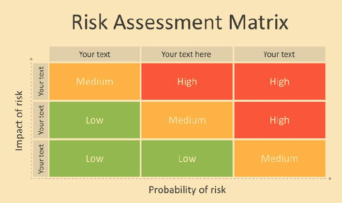

Once you define the matrix, you place the risks that you identified in it. Then address the ones for which both impact and probability are highest first. 

You can define yourself the levels of: 

- **Probability** (**Likelihood**) e.g.: {Certain, Likely, Possible, Unlikely, Rare}

- **Impact** (**Severity**). e.g.: {Insignificant, Negligible, Marginal, Critical, Catastrophic}

Or you can reuse existing pre-defined levels. See two examples below.

#### Severity Can Have Many Levels — Not Just Three

"High / Medium / Low" is a starting point, not the ceiling. Finer scales let you distinguish "annoying" from "career-ending."

cf. Security Risk Management Body of Knowledge
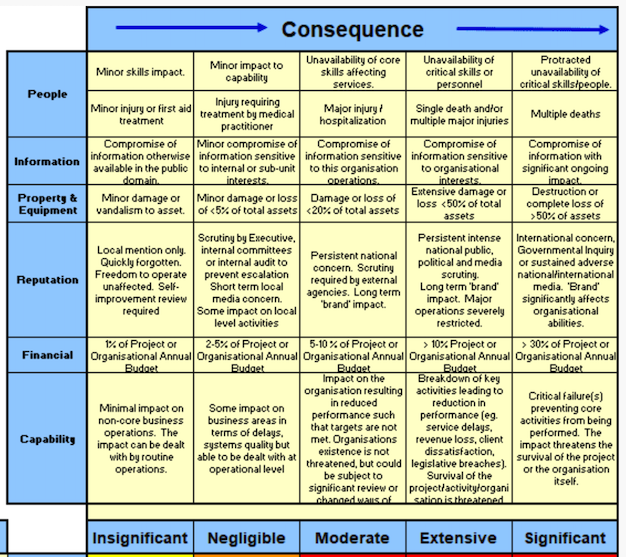


#### Likelihood Can Also Have More Degrees

Same idea for probability: {Certain, Likely, Possible, Unlikely, Rare} beats a coarse "probably/maybe/no."

cf. Security Risk Management Body of Knowledge

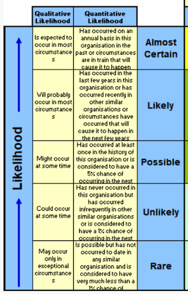


## Simulate attacks on your own system before someone else does

> "blue teams always need **red teams** to test them against each other"

**Penetration testing** simulates attacks on your own system to find the holes before someone else does. Today we'll focus on one tool — **Metasploit** + its **WMAP** web scanner plugin — in the exercise. There's a broader ecosystem (Kali Linux, nmap, OWASP ZAP, Detectify, Shodan, Mozilla Observatory) collected in the appendix at the end of the deck.

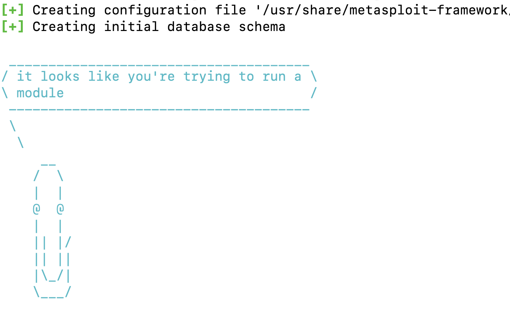


## Detection is usually too late — but when it's all you have, it needs a baseline and constant monitoring

Is hard. And it is usually a little bit too late. So better focus on preventing. 

### Warning signs that you might have an intruder

 - You can't access your server !!!
 - Your server IP has been blacklisted
 - Abnormal network traffic (that's why you monitor!)
 - Unusual resource usage (ditto)

### Baseline normal, monitor for deviations, stop exfiltration at the edge

- Develop baseline for normal
- Monitor 

- Stop intruders from taking information out 
  - firewall
  - traffic filtering
  - white/black listing
  
- Auditing, compliance testing

 
# 10 Practical Advices to Improve Security in DevOps

*What follows is how to operationalize the OWASP Top 10 in your DevOps workflow. Each advice maps to one or more of the threat categories we just named.*


## Every dependency is an attack vector — keep them current and scanned

*(OWASP #6: Vulnerable & Outdated Components)*

> **Principle**: *"If its part of your app, it should be part of your security process"*


We are standing on the shoulders of giants. And this is a benefit, but also a challenge. 


One of the most important attack vectors on your system are all the ***giants*** your application is *"**standing on the shoulders of**"*. 


Best approach here is to:
- **Always keep dependencies up to date**
- This is why we use dependencies, to get updates for free and this is why they're better than copy-pasting code from generative ai tools.


One way to do that is to 
- Automatically update dependencies when new releases become available
	- Though, maybe you want to wait a few days before automatic updates


Another thing to do is: 
- **Scan dependencies for security breaches**
  - source code and container images too (e.g. 
	  - `snyk` as a tool for scanning
	  - `docker scout` as a first-class command!
  - add security checks as part of your CI

Example of output from `snyk container test elasticsearch:7.6.2`: 

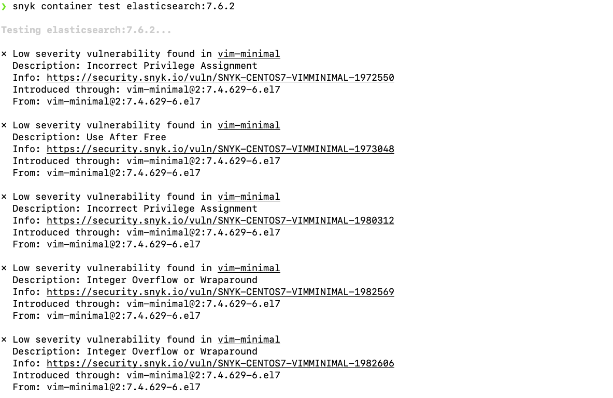

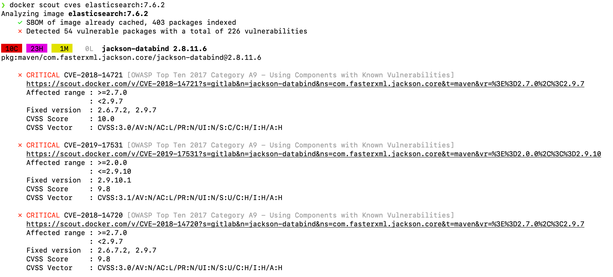


Or when I run `snyk` on my own project, `zeeguu/api` I get this as one example. Can you tell me what's the solution? 

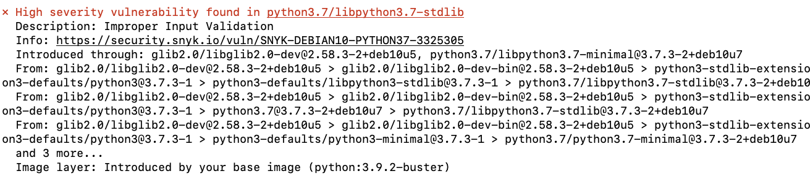

Note: DockerHub has info about image vulns (e.g. [3.9.2-buster](https://hub.docker.com/_/python/tags?page=&page_size=&ordering=&name=3.9.2-buster) vs. [3.12.3](https://hub.docker.com/layers/library/python/3.12.3/images/sha256-49f4118027f9494ebe47d3d9b6c7a46b6d7454a19a7ba42eca32734d8108b323?context=explore)).  

**For your project**: consider adding a step in the CI/CD pipeline that checks for vulnerabilities

Case Study: [Postmortem for Malicious eslint Packages Published on July 12th, 2018](https://eslint.org/blog/2018/07/postmortem-for-malicious-package-publishes)

Case Study: [axios@1.14.1 supply chain attack (March 2026)](https://socket.dev/blog/axios-npm-package-compromised) -- the maintainer's npm account was hijacked and a malicious version was published that added `plain-crypto-js`, a package that didn't exist the day before. It deployed a RAT (remote access trojan) via a postinstall hook. axios has 100M+ weekly downloads, so every `npm install` pulling latest was potentially compromised. Mitigation: use `npm ci` (installs exactly from lockfile), pin dependency versions, and set `min-release-age=7` in `.npmrc` to refuse packages published less than 7 days ago.


## Run containers as a non-root user

*(OWASP #1: Broken Access Control) — assume the base image or a dependency could be malevolent.*

### Use the USER directive in your Dockerfile

Switch to a non-root user after installing dependencies:

```Dockerfile 
FROM ubuntu:latest
RUN apt-get update && apt-get install -y curl

RUN useradd -m myuser
USER myuser
WORKDIR /home/myuser
# ... continue ...
```

For how not to trust code running in your web app: [fascinating thought experiment about a malicious npm package](https://david-gilbertson.medium.com/im-harvesting-credit-card-numbers-and-passwords-from-your-site-here-s-how-9a8cb347c5b5).


### Container UID = host UID; no translation by default

In containers, **UID 0 inside = UID 0 on the host** — the kernel is shared and there is no UID translation by default.

Isolation comes from namespaces, capabilities, seccomp, cgroups. If any of them has a hole, the process is *already* root on the host — no privilege escalation needed.

**It has happened:**
- *CVE-2019-5736 (runc)* — overwrite the host's `runc` from inside a container → root on host
- *CVE-2024-21626 ("Leaky Vessels", runc)* — fd leak → host filesystem access
- *Dirty Pipe (CVE-2022-0847)* — kernel bug, rewrite host binaries from a container


### The real fix — user namespaces — isn't default in 2026

The "real" fix is user namespaces (UID 0 in container → UID 100000 on host).

Podman has it by default; Kubernetes made `UserNamespacesSupport` stable in 1.33 (2025) but pods must opt in with `hostUsers: false`.

In 2026, Docker still doesn't enable it by default. Until then, `USER` turns a one-bug total host compromise into a two-bug one.


### Non-root breaks bind-mount ergonomics — and until user namespaces are default, you live with workarounds

Running as non-root has a real cost — **bind-mounted files stop working**.

A container is just a process. When it calls `open()`, the kernel checks the file's on-disk UID against the process's UID. No container magic, just 1970s Unix permissions.

So if your Dockerfile says `useradd -m myuser` (UID 1000) and you mount your host home directory:

```bash
docker run -v /home/mircea/data:/data myimage
```

...the container reads `/data` as UID 1000 — but your files on the host might be owned by UID 1001, or 501 (macOS), or anything else. **The image builder has no way to know the host UID at build time.** Result: `EACCES`.

**Common escape hatches, all ugly:**
- `docker run -u $(id -u):$(id -g)` — override UID at runtime to match the host, but then `/home/myuser` inside the container is owned by the wrong user
- `chown` the files to the container's UID (manual on the host, or via an entrypoint script) — now the container can read them, but **you need `sudo` on the host** to edit your own files, and entrypoint chown silently mutates host data on every run
- Use named volumes instead of bind mounts — works, but you lose host-side editing
- **Anti-pattern:** `chmod -R 777 /data` — "works" by removing permission checks entirely. But now any process on the host, or any escaped container, can read/write that data. You just paid the ergonomic cost of running non-root and threw away the security benefit. Tempting; don't.

**The proper fix** — user namespaces + idmapped mounts — adds *two* translation layers (one at the process end, one at the mount end) so the kernel can show a file owned by host UID 1000 as UID 1000 *inside* the container. Retrofitting multi-tenant isolation onto a single-UID-space permission model, one syscall-boundary trick at a time. Which is why, in 2026, it's still not the default.


## All input is bad until proven otherwise — validate on the client, the API, and in the DB layer

*(OWASP #3: Injection)*

Another attack vector is the **inputs in your application**. The photo below is from a legendary story where one good American citizen tried to delete the DB of the auto registry. 

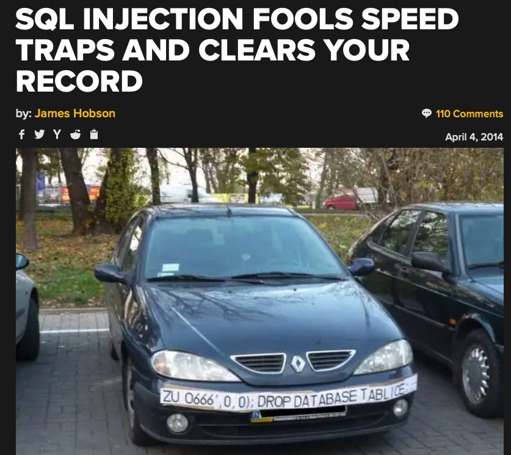


The solution to this is: 
- **Validate web input before using it**
  - in the webpages
  - in the API

- Use parameterized DB queries (or whatever framework help you can)


## Keep server software patched and run hardening audits

- Keep server software up to date
	- e.g. [`apt-get install unattended-upgrades`](https://wiki.debian.org/UnattendedUpgrades)


- System hardening
	- analyzes the system from within
	- treats the system as white box as opposed to blackbox
	- e.g. [`sudo lynis audit system`](https://www.digitalocean.com/community/tutorials/how-to-perform-security-audits-with-lynis-on-ubuntu-16-04#step-2-performing-an-audit)


- Use hardened containers (e.g. https://docs.docker.com/dhi/)


## Secrets belong in vaults, never in git — and the vault itself needs 2FA

- Don’t commit credentials and other secrets (like keys and certs) into a VCS repository

- Use 2FA for secret repositories

- Consider using dedicated tools and vaults for secrets (e.g. `docker secret`)

Case Study: [The Uber Breach](https://www.bloomberg.com/news/articles/2017-11-21/uber-concealed-cyberattack-that-exposed-57-million-people-s-data) - started accessing a private GitHub repo, where keys were found for an AWS account, etc.

- Legend has it that when I was a student, one of the lecturers in our university has declared his love for his wife by sharing with her the root password for one of his servers. There are other ways to show love :) 


## Treat your CI/CD pipeline with the same paranoia as production

- CI pipeline is part of your infrastructure
- Make sure that it's secure (2FA, etc.)

Case Studies: 
- US government agencies [hacked due to misconfiguration of their TeamCity CI tool](https://cd.foundation/blog/2021/01/07/could-ci-cd-tool-teamcity-really-have-been-exploited-to-hack-the-us/)
- That very safe OS of NASA that red team changed the code


## A backup you haven't restored is not a backup

- Data is probably your most precious asset; don't lose it

- Test your full recovery process! 

	- A backup is not useful unless you can use it to actually perform the backup

## Red-team yourself — it's cheaper than being red-teamed by strangers

Use the tools from the Testing section above.

- Create a red team to pen test

- Stress the app infrastructure


## Defense in depth — one wall is never enough

Recall the ElasticSearch migration story: the firewall was fine, but the ES database had no password. One layer failed → total compromise.

- Cloud based firewall but firewall also on every machine

- 2FA


## You can't detect what you don't log, and you can't react to what you don't monitor

*(OWASP #9: Security Logging and Monitoring Failures)*

Monitor
- traffic
- accesses

Log everything. This is the key to being able to detect attacks 


# What Next?

- Exercise: [Pen testing with Metasploit / wmap](./README_EXERCISE.md)

- Practical: [Own security assessment + Hardening](./README_TASKS.md)

- TLS & Certbot: [TLSTutorial](TLSTutorial.md)


# Appendix: a reference catalogue of pen-testing tools

Skim, bookmark, reach for during the exercise or later.

### Platforms

- **Kali Linux** — security-focused distro with a huge [tools listing](https://tools.kali.org/tools-listing), installable as [meta-packages](https://www.kali.org/news/kali-linux-metapackages/) (`top10`, `web`, `wireless`, …).

### Frameworks & Scanners

- **Metasploit** — Ruby-based vulnerability framework, very popular, huge plugin library. [Source](https://github.com/rapid7/metasploit-framework), [book](https://books.google.dk/books?id=EOlODwAAQBAJ).
- **WMAP** (Metasploit plugin) — feature-rich web application scanner, originally derived from SQLMap, integrated with Metasploit. [Docs](https://www.offensive-security.com/metasploit-unleashed/wmap-web-scanner/). *Used in the exercise.*
- **nmap** — port scanning. [Docs](https://nmap.org/book/man-port-scanning-basics.html).
- **skipfish** — web application reconnaissance. [Docs](https://www.systutorials.com/docs/linux/man/1-skipfish/).

### Desktop Apps

- **OWASP ZAP** — free, OSS pen-testing tool maintained by OWASP. [Getting started](https://www.zaproxy.org/getting-started/), [docs](https://www.zaproxy.org/docs/api/#introduction).
- More from [OWASP's vulnerability scanning tool list](https://owasp.org/www-community/Vulnerability_Scanning_Tools).

### Online Services

- **Detectify** ([detectify.com](https://detectify.com/)) — polished; requires account + domain proof.
- **Mozilla Observatory** ([observatory.mozilla.org](https://observatory.mozilla.org/)) — free web security scan.
- **Shodan** ([shodan.io](https://shodan.io)) — search engine for internet-exposed services.

